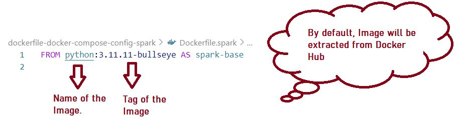
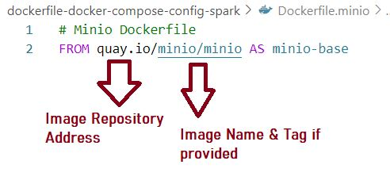

## LEARN DOCKER
### **DATA ENGINEERING - Learn Essential Docker Commands**

Docker Engine is a free and open-source containerization software that runs directly on the host system to build and manage containers. Docker Desktop is a separate product that packages Docker Engine along with additional features such as a user interface (UI), Docker CLI, and integrations for better development workflows. While Docker Desktop offers a convenient setup and improved user experience, it requires a paid subscription for commercial use.

*In this tutorial, Docker Engine is installed within Windows Subsystem for Linux (WSL) and Docker commands will be used to interact with the Docker Engine and manage containers. Using this setup, Docker Engine can pull and run different Docker images based on Dockerfiles. Additionally, Docker Compose is used to define and manage multi-container applications by orchestrating multiple services using separate Dockerfiles.*

Refer below link to setup docker in WSL - 
https://gist.github.com/dehsilvadeveloper/c3bdf0f4cdcc5c177e2fe9be671820c7 

Refer below link to setup docker in Ubuntu -
https://docs.docker.com/engine/install/ubuntu/

### **What is Docker -**
*Docker is a containerization platform that allows developers to package, ship, and run applications in containers. Containers are lightweight and portable, and they provide a consistent and reliable way to deploy applications. Docker provides a way to create, deploy, and manage containers, and it supports a wide range of programming languages and frameworks.*

Think of it in this way, for installing DBT or Airflow, one will setup a server and install the required packages. Now if any other service needs to be installed, it will be installed on the same server. Now there might be issue with compatibility of certain common packages which is used by both these services. 

Docker solves this problem by creating a separate and isolated environment for each service. This way, each service can have its own environment and can be installed independently without affecting other services. This is the main advantage of Docker.

#### Difference between Virtual Machine and Docker -
1. **Virtual Machine (VM)**
    - A VM is a virtualized computing environment that runs on a physical machine using a hypervisor.
    - Each VM has its own guest operating system, kernel, file system, and network stack.
    - VMs are more resource-intensive than containers because they include an entire OS and require hardware-level virtualization. However, VMs provide strong isolation between applications since each VM is independent.

2. **Docker (Containers)**
    - Docker allows applications to be packaged into containers, which are lightweight and portable.
    - Containers share the host OS kernel (Kernel is the core component of the OS that directly interacts with the hardware) i.e. Docker Engine uses the host OS kernel to run containers but maintain isolated user spaces, including the file system, network, and process namespaces.
    - They do not require a separate OS, making them faster, more efficient, and less resource-intensive than VMs.
    - Docker supports a wide range of programming languages and frameworks, making it highly versatile.

Docker community is very large and there are many pre-built images available in Docker Hub or other image repository, which can be used to create a container. These images can be used to create production-ready containers. 

Docker also provides a way to create custom images using ***Dockerfile***. Dockerfile is a text file that can be used to create a custom image. It contains a series of instructions that will be used to create a custom image. Dockerfile can be used to install packages, copy files, and set environment variables. 

These Dockerfiles can be used in ***Docker Compose*** to create multiple containers, Docker Compose helps to orchestrate multiple containers. It can be used to create a network of containers, and it can be used to manage the lifecycle of containers.

#### Main components of Docker -
1. **Docker Engine** - This is the core component of Docker that runs on the host machine. It is responsible for creating, managing, and running containers. Docker Engine is the component that interacts with the host OS kernel to run containers.
2. **Docker CLI** - This is the command-line interface to Docker Engine. It is used to interact with Docker Engine and manage containers. Docker CLI can be used to create, start, stop, and delete containers.
3. **Docker Hub** - This is a public registry (https://hub.docker.com/) of Docker images. It is a repository of pre-built images that can be used to create containers. Docker Hub provides a way to share and discover Docker images. Pre-built images from other docker image repository, https://quay.io/search can also be used.
4. **Dockerfile** - This is a text file that can be used to create a custom image. It contains a series of instructions that will be used to create a custom image.
5. **Docker Compose** - This is a tool that can be used to define and manage multi-container applications. It can be used to create a network of containers and manage the lifecycle of containers.

###### NOTE- 
Pre-built docker images used in the Dockerfile and Docker Compose example files of this tutorial are available in Docker hub, https://hub.docker.com/. Pre-built images from other docker image repository, https://quay.io/search can also be used.

***Docker image from docker hub referenced in Dockerfile*** - 

***Docker image from quay referenced in Dockerfile*** - 

#### Difference between Docker Image and Container -
1. **Images** - Images are the templates used to create containers. They are essentially a snapshot of a file system and the configuration of the container. Images are immutable, meaning they cannot be changed once they are created. Images are stored in Docker Hub or other image repository.
2. **Containers** - Containers are the runtime instances of images. They are the actual running environment for an application. Containers are created from images and can be started, stopped, and deleted. Containers are ephemeral, meaning they can be deleted and recreated at any time. Containers are stored on the host machine. One image can be used to create multiple instances of the container.

### **Following services are covered -**
1. Dockerfile 
2. Docker Compose 
3. Docker Commands via CLI
4. Publish Docker Image to image repository

### **How to navigate through this Repo -**
1. Read this readme file, to understand the theory of docker.
2. Navigate to **`./dockerfile-config-dbt/README.md`**: 
    - This will help to understand basics of Dockerfile and how to build/ create image and start the container.
    - Directory **`./dockerfile-config-dbt/`** will contain all the files related to Dockerfile. 
    - This will also help get details on volume, network and other docker concepts.
3. Navigate to **`./dockerfile-docker-compose-config-spark/README.md`**: 
    - This will help to understand basics of Dockerfile and Docker Compose and how to orchestrate multi container docker service.
    - Directory **`./dockerfile-docker-compose-config-spark/`** will contain all the files related to Dockerfile, Docker Compose.
    - This will also help get details on volume, network, and other docker concepts.
4. Navigate to **`./docker-commands.md`**: 
    - This will help to understand common docker commands to build and manage the containers, images and how to publish the images to Docker Hub or other registries.

