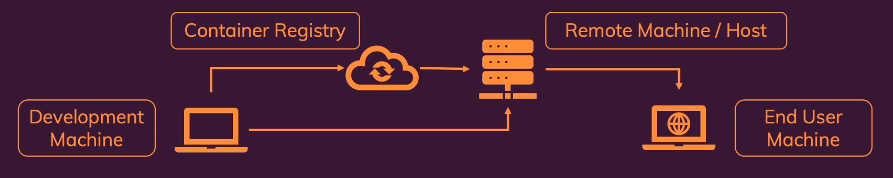

## **Docker Deployment**

### Things to Consider Before Deployment
- Bind mounts shouldn't be used in production. 
- Containerized applications might need build step.
- Multiple container projects might need to be split across multiple hosts or remote machines.

### Why Bind Mounts Shouldn't Be Used in Production
- In Development -
    - Bind mounts are used to provide local files to the container.
    - They are useful for development because they allow you to see changes in real-time.
    - Files are updated in the container without needing to restart the container.
- In Production -
    - A container should work standalone and not depend on the host machine.
    - Ensure every image runs without any dependencies of the host machine.
    - Use Copy command to copy files into the image.

### Docker Container deployment providers
There are many docker deployment providers available. Some of the most popular ones are from:
- AWS - https://aws.amazon.com/containers/services/
- Google - https://cloud.google.com/containers
- Azure - https://azure.microsoft.com/en-us/products/category/containers

### Standalone Docker Container deployment steps
- Install Docker on the remote host machine (via SSH).
- Push and pull image to and from container repository (e.g., Docker Hub).
- Run the container on the remote host machine using SSH.
- End user will access the application via the host machine's IP address and port.
<br>



### Manual Deployment Steps
- Get a VM service from a cloud provider (e.g., AWS, Azure, Google).
- SSH into the VM and install Docker.
    - https://docs.docker.com/engine/install/  
- Build the image in local and push the image to a container repository.
    - Docker commands for building the image in local and pushing it to a container repository can be found here in ./docker-commands.md file.
    ***Note : To push the developed image to VM there are following 2 options.***
        1. ***Push the source code to the VM and build the image there.***
        2. ***Build the image in local and push the image to a container repository and pull it in the VM.*** 
            - ***This method is preferred as it is faster and easier***
            - ***Required files to run the image will be directly copied during the local build and not need to manage that separately using any bind mounts.***

- Pull the image from the container repository in the VM.
    - If the image is publicly available, it can be pulled directly using the command:
        ```bash
        docker pull <image-name>:<tag>
        ```
    - If the image is private, login to the container repository and pull the image. Docker commands can be found here in ./docker-commands.md file.
        ```bash
        docker login <container-repository-url>
        docker pull <image-name>:<tag>
        ```
- Run the container in the VM using the command:
    ```bash
    docker run -d -p <host-port>:<container-port> <image-name>:<tag>
    ```

- Network management to the VM is important. The VM should be accessible from the internet and the ports should be open for the application to be accessible.
- End user will access the application via the VM's IP address and port.
- ***Disadvantage - Any change in the code will require the image to be rebuilt and pushed to the container repository again. The VM will need to pull the new image and run it again.***


### Managed Services - Creation, Management and Updating is handled automatically
