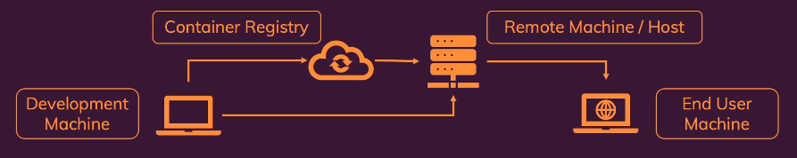

## **Docker Deployment**

### Things to Consider Before Deployment
- Bind mounts shouldn't be used in production. 
- Containerized applications might need build step.
- Multiple container projects might need to be split across multiple hosts or remote machines.

### Why Bind Mounts Shouldn't Be Used in Production
- In Development -
    - Bind mounts are used to provide local files to the container.
    - They are useful for development because they allow you to see changes in real-time.
    - Files are updated in the container without needing to restart the container.
- In Production -
    - A container should work standalone and not depend on the host machine.
    - Ensure every image runs without any dependencies of the host machine.
    - Use Copy command to copy files into the image.

### Docker Container deployment providers
There are many docker deployment providers available. Some of the most popular ones are from:
- AWS - https://aws.amazon.com/containers/services/
- Google - https://cloud.google.com/containers
- Azure - https://azure.microsoft.com/en-us/products/category/containers

### Standalone Docker Container deployment steps
- Install Docker on the remote host machine (via SSH).
- Push and pull image to and from container repository (e.g., Docker Hub).
- Run the container on the remote host machine using SSH.
- End user will access the application via the host machine's IP address and port.
<br>



## Deployment Methods
### Manual Deployment Steps
In Manual Deployment Steps, the user has to manage the VM and the container. Its a bit tedious and time consuming. The user has to manage the VM, the container, the network, the security, the logging, the monitoring, the scaling, the resource limits, the IAM roles and permissions, the load balancer, the DNS, the storage and backup options, and the deployment and rollback options. The user has to manage everything manually.

#### Steps
- Get a VM service from a cloud provider (e.g., AWS, Azure, Google).
- SSH into the VM and install Docker.
    - https://docs.docker.com/engine/install/  
- Build the image in local and push the image to a container repository.
    - Docker commands for building the image in local and pushing it to a container repository can be found here in ./docker-commands.md file.
    ***Note : To push the developed image to VM there are following 2 options.***
        1. ***Push the source code to the VM and build the image there.***
        2. ***Build the image in local and push the image to a container repository and pull it in the VM.*** 
            - ***This method is preferred as it is faster and easier***
            - ***Required files to run the image will be directly copied during the local build and not need to manage that separately using any bind mounts.***

- Pull the image from the container repository in the VM.
    - If the image is publicly available, it can be pulled directly using the command:
        ```bash
        docker pull <image-name>:<tag>
        ```
    - If the image is private, login to the container repository and pull the image. Docker commands can be found here in ./docker-commands.md file.
        ```bash
        docker login <container-repository-url>
        docker pull <image-name>:<tag>
        ```
- Run the container in the VM using the command:
    ```bash
    docker run -d -p <host-port>:<container-port> <image-name>:<tag>
    ```

- Network management to the VM is important. The VM should be accessible from the internet and the ports should be open for the application to be accessible.
- End user will access the application via the VM's IP address and port.
- ***Disadvantage - Any change in the code will require the image to be rebuilt and pushed to the container repository again. The VM will need to pull the new image and run it again.***


### Managed Container Services Deployment
**Managed Container Services** - 
    - Creation, management and updating is handled automatically.
    - No need to manage the VM or the container.
    - Load balancing, scaling, resource limits, IAM roles and permissions, logging, monitoring, health checks, restart policy, network options, security options, storage options and backup options are handled automatically. 
    - End user will only have to manage the image and the container repository. 

#### Steps
- Identify the managed container service from the cloud provider like AWS, Azure or Google.
- Build the image in local and push the image to a container repository.
    - *Docker commands for building the image in local and pushing it to a container repository can be found here in ./docker-commands.md file*
- Create a managed container service in the cloud and follow the steps to deploy the image.
    - Mention the container repository URL and the image name.
        - *Follow documentation for multi container deployment if required.*
    - Specify the ports to be exposed and the environment variables to be set.
    - To persists the data in Container - 
        - In Local, Persisting the data after container is stopped is handled using bind mounts.
        - In Cloud, This needs to be handled using cloud storage options like AWS S3, Azure Blob Storage, Google Cloud Storage, etc.
        - *Note - The data will be persisted in the cloud storage and not in the container. The container will be stopped and started again with the new image. The data will be available in the cloud storage and can be accessed from the container.*
    - Specify the command to run the container and the entry point to be used.
    - Managing the container versioning, while updating the image.
    - Manage container internal communication.
        - *Note - Internal Container communications is generally handled differently in local and in cloud.*
        - *For example, In local, communication between containers is handled using container name followed by the port number like "spark://spark-master:7077" however In cloud, Its handled differently, read the documentation of the managed container service for more details, for example in AWS Managed container service, the communication is handled like "spark://localhost:7077"*
        - *Due to this, If the code which executes in the docker container and if the code communicates between different containers then the connection need to be modified. For Example, the spark entrypoint file used in this tutorial (Path - ./dockerfile-docker-compose-config-spark/entrypoint.sh ) needs to be updated by changing master node connection method from "spark://spark-master:7077" to "spark://localhost:7077"*
    - Specify the backup options.
    - Specify the scaling options and the resource limits.
    - Specify the network options and the security options.
    - Specify the logging and monitoring options.
    - Specify the health check options and the restart policy. 
    - Specify the load balancer options and the DNS options.
    - Specify the deployment options and the rollback options. 
- Ensure the container is running and accessible via the managed service's IP address and port.
- End user will access the application via the managed service's IP address and port.

## Best Practices
- Use Multi stage build in Dockerfile to reduce the image size.
- Check vulnerabilities in the image before deploying it.
- Use a container repository to store the images.
- Use a managed container service to deploy the images.
- Use a cloud storage option to persist and backup the data.
- Use a logging and monitoring service to monitor the container.
- Use a health check and restart policy to ensure the container is running.
- Use a load balancer to distribute the traffic.
- Use a DNS service to manage the domain name.

## Kubernetes Deployment
Kubernetes is one of the main component in the container deployment. It is a container orchestration tool that automates the deployment, scaling, and management of containerized applications.

It is used to manage the deployment of multiple containers across multiple hosts. It provides features like load balancing, scaling, resource limits, IAM roles and permissions, logging, monitoring, health checks, restart policy, network options, security options, storage options and backup options. It is a powerful tool for managing containerized applications in production.

Follow "kubernetes-learn-hands-on" repository for more details on Kubernetes.