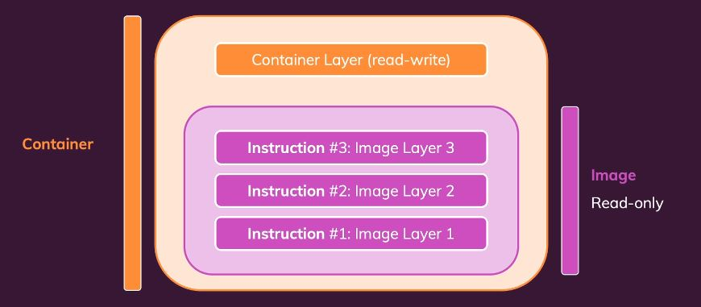

##### Types of Docker Images
Docker image is a lightweight, standalone, and executable package that includes everything needed to run a piece of software
- **Bookworm** refers to the codename for the latest stable release of Debian.
- **Slim** indicates a minimal version of a Debian distribution with only the essential packages installed
- **Bullseye** is the codename for the previous stable Debian release
- **Alpine** is the “Dockerized” version of Alpine Linux


##### Create Containers using Dockerfile
- **Dockerfile -** 
It is a text file that contains instructions for building a Docker image. It is used to create a Docker image from a Dockerfile. 
**Dockerfile Reference** - "docker-learn-hands-on/dockerfile-config-dbt/Dockerfile" 
    - **`FROM`** - specifies the base image to use for the new image. In this case, python :3.12-slim is used as the base image
    - **`WORKDIR`** - sets the working directory in the container to /usr/local/app
    - **`COPY`** - copies files from the current directory into the container at the specified path
    - **`RUN`** - executes a command while creating the image. In this case, it installs the python packages mentioned in the requirements.txt file
    - **`CMD`** - specifies the default command to run when the container is started. In this case, CMD ["tail", "-f", "/dev/null"] is used to keep the container running indefinitely.
    - **`Volume`** - Specify the container path which will be mapped to the host machine path. In this case, the /usr/local/app directory is used.
    - **`EXPOSE`** - Specifies the port that the container listens on. In this case, port 8080 is used. 
      - **Note** - `EXPOSE 8080` in the Dockerfile is optional. It documents that a process in the container will expose this port. But its required to actually expose the port with `-p` when running docker run. So, it is a best practice to also add EXPOSE in the Dockerfile to document this behavior.
  
  Each set of instructions in the Dockerfile is called a **Layer**. These layers are cached and will only be re-evaluted if the instruction changes. This makes the build process much faster. Creating a container from an image is also a layer.

  

- **Difference between Entrypoint and CMD**

  |Feature|ENTRYPOINT|CMD|
  | -------- | ------- |-------- |
  | Purpose|Defines the main command|Provides default command/arguments|
  | Overridable?|No (unless --entrypoint is used)|Yes (can be overridden at runtime)|
  | Flexibility|Used for required commands|Used for default commands but can be overridden|
  | Example|ENTRYPOINT ["ping"]|CMD ["localhost"]|
  | Runtime Override|docker run my-container 8.8.8.8 (adds argument to Entrypoint)|docker run my-container ls (overwrites CMD Script)|

- **Using ENTRYPOINT and CMD Together**
When using both ENTRYPOINT and CMD, the ENTRYPOINT is used as the main command and the CMD will pass the arguments to ENTRYPOINT.

  Example - Consider below sample Dockerfile - 
  ```
  # Dockerfile
  FROM ubuntu
  ENTRYPOINT ["ping"]
  CMD ["localhost"]
  ```
  When the container is created and running, it will use the ENTRYPOINT script with the argument provided in the CMD. If the script needs to be executed with different argument, then CMD can be overridden at runtime.
  ```
  # Executing below docker command will run script "ping localhost" 
  # "ping" is the Entrypoint script and "localhost" is the argument provided in CMD
  docker run my-container
  ```
  ```
  # Executing below docker command will run script "ping 8.8.8.8" 
  # "ping" is the Entrypoint script and "8.8.8.8" is the CMD argument overidden at runtime
  docker run my-container 8.8.8.8
  ```

- **Docker execution Commands -** 
  - Since Docker is installed in WSL, therefore open the WSL (Windows Subsystem for Linux) terminal and navigate to the directory where the Dockerfile is located.
  - Run the command `docker build -t <image-name> .` to build the Docker image
    - **docker build**: This is the command to initiate the image building process
    - **-t <image_name>**: This flag is used to tag the image with a name. This makes it easier to identify and reference the image later.
    - **.** : This indicates that the Dockerfile is located in the current directory.
    
    ``` 
    # Build dockerfile to create a new image
    docker build -t dbt_learn_image .
    ```
  - Run the command `docker run -p <docker_port>:<host_port> -it --rm -v "<host/folder : docker/folder >" --name <container-name> <image-name>` to create and run a new container from the Docker image
  
    - **docker run**: This command is used to create a new container from the Docker image
    - **-it**: This flag is used to allocate a pseudo-TTY to the container and keep the container running even after the command is executed
    - **--rm**: This flag is used to automatically remove the container when it is stopped 
    - **-v "<host/folder : docker/folder>"**: This flag is used to mount a volume from the host machine to the container. This allows the container to access files from the host folder and vice versa.
    - **-p <docker_port>:<host_port>**: This flag is used to map a port from the host machine to the container. This allows the container machine to be accessed from the host machine.
    - **--name <container-name>**: This flag is used to specify the name of the container
    - **<image_name>** : This is the name of the Docker image created in the previous step

    ```
    # Run the container from the newly created image and mount the volume with host folder
    # while using WSL (Windows Subsystem for Linux), path should be in the format /mnt/c/path/to/folder
    # Syntax : docker run -it --rm -p 8080:8080 -v "/mnt/c/host/path:/usr/container/path" --name <container-name> <image-name>

    docker run -p 8080:8080 -v /mnt/c/host/path:/usr/container/path --name dbt-learn-hands-on dbt_learn_image
    
    ``` 
  - Start the shell of running container in Host machine using the following command
    ```
    # Get the container name or id by executing
    docker ps -a

    # Start the shell of running container in Host machine.
    docker exec -it <container_name_or_id> /bin/bash
    ```
    