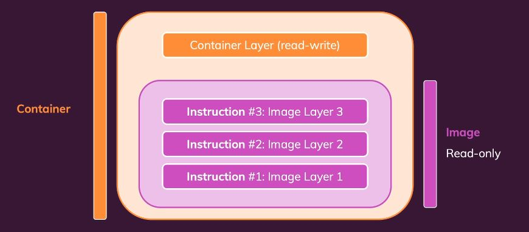

###### The following document will help to understand the concept of the Dockerfile and Docker Compose, After reading this document, go through all the files present in the folder and try to understand the code.

### Types of Docker Images
Docker image is a lightweight, standalone, and executable package that includes everything needed to run a piece of software
- **Bookworm** refers to the codename for the latest stable release of Debian.
- **Slim** indicates a minimal version of a Debian distribution with only the essential packages installed
- **Bullseye** is the codename for the previous stable Debian release
- **Alpine** is the “Dockerized” version of Alpine Linux


### Create Dockerfile
- **Dockerfile -** 
It is a text file that contains instructions for building a Docker image. It is used to create a Docker image from a Dockerfile. 
**Dockerfile Reference** - **`docker-learn-hands-on/dockerfile-docker-compose-config-spark/Dockerfile.spark`**
    - **`FROM`** - specifies the base image to use for the new image. In this case, python:3.11.11-bullseye is used as the base image
    - **`ENV`** - sets the Environment Variable in the new image
    - **`WORKDIR`** - sets the working directory in the container to /opt/spark
    - **`COPY`** - copies files from the current host directory into the container at the specified path
      - **.dockerignore file**
        ```file
        # .dockerignore
        *.log
        *.tmp
        ```
        - The `.dockerignore` file is used to specify files and directories that should be excluded from the build context when building a Docker image.That means in case of any Copy activity in docker file, the files and directories specified in `.dockerignore` will not be copied to the image.
        - This file is similar to `.gitignore` in Git, where patterns for files and directories can be specified to ignore.
        - The `.dockerignore` file is placed in the root of the build context directory and is used by Docker to determine which files to exclude when building the image.
    - **`RUN`** - executes a command while creating the image. In this case, it installs the python packages mentioned in the requirements.txt file
    - **`CMD`** - specifies the default command to run when the container is started. Script mentioned in this command can be overridden while running the container. 
    - **`Volume`** - specify the container path which will be mapped to the host machine path. In this case, the /usr/local/app directory is used.
    - **`Entrypoint`** - specifies the main command that will always run when a container starts. CMD and ENTRYPOINT can be used together where ENTRYPOINT will have fixed script and CMD will provide arguments to that Entrypoint script. If Entrypoint is not defined then default script present in CMD will be executed.
    - **`EXPOSE`** - Specifies the port that the container listens on. *It is not used in the Dockerfiles present in this folder.* 
      - **Note** - `EXPOSE 8080` in the Dockerfile is optional. It documents that a process in the container will expose this port. But its required to actually expose the port with `-p` when running docker run. So, it is a best practice to also add EXPOSE in the Dockerfile to document this behavior.
  
  Each set of instructions in the Dockerfile is called a **Layer**. These layers are cached and will only be re-evaluted if the instruction changes. This makes the build process much faster. Creating a container from an image is also a layer.

  

- **Difference between Entrypoint and CMD**

  |Feature|ENTRYPOINT|CMD|
  | -------- | ------- |-------- |
  | Purpose|Defines the main command|Provides default command/arguments|
  | Overridable?|No (unless --entrypoint is used)|Yes (can be overridden at runtime)|
  | Flexibility|Used for required commands|Used for default commands but can be overridden|
  | Example|ENTRYPOINT ["ping"]|CMD ["localhost"]|
  | Runtime Override|docker run my-container 8.8.8.8 (adds argument to Entrypoint)|docker run my-container ls (overwrites CMD Script)|

- **Using ENTRYPOINT and CMD Together**
When using both ENTRYPOINT and CMD, the ENTRYPOINT is used as the main command and the CMD will pass the arguments to ENTRYPOINT.

  Example - Consider below sample Dockerfile - 
  ```
  # Dockerfile
  FROM ubuntu
  ENTRYPOINT ["ping"]
  CMD ["localhost"]
  ```
  When the container is created and running, it will use the ENTRYPOINT script with the argument provided in the CMD. If the script needs to be executed with different argument, then CMD can be overridden at runtime.
  ```
  # Executing below docker command will run script "ping localhost" 
  # "ping" is the Entrypoint script and "localhost" is the argument provided in CMD
  docker run my-container
  ```
  ```
  # Executing below docker command will run script "ping 8.8.8.8" 
  # "ping" is the Entrypoint script and "8.8.8.8" is the CMD argument overidden at runtime
  docker run my-container 8.8.8.8
  ```

### Create Docker Compose File
- **docker-compose.yml -** 
**"docker-compose.yml"** is a YAML file that defines and orchestrate multi-container Docker applications. It is used to create and manage multiple containers that are linked together.
  - Dockerfile created in above step can be added in docker compose to create a Docker image and then run the container.
  - Docker base image can also be specified direcly in docker compose without creating a Dockerfile.

**Docker Compose file Reference** - **`docker-learn-hands-on/dockerfile-docker-compose-config-spark/docker-compose.yml`**

```
version: '3.9'

services:
  spark-master:
    container_name: container-spark-master
    build: 
      context: .
      dockerfile: Dockerfile.spark
    image: spark-image
    entrypoint: ['./entrypoint.sh', 'master']
    healthcheck:
      test: [ "CMD", "curl", "-f", "http://localhost:8080" ]
      interval: 5s
      timeout: 3s
      retries: 3
    volumes:
      # - "/mnt/c/Users/jerin/OneDrive\ -\ Aligned\ Automation/Work/Learn/Tech Solutions/integration-spark-catalog-lakehouse/spark-working-folder/data:/usr/hive-metastore/data"
      - "/mnt/c/Users/jerin/OneDrive\ -\ Aligned\ Automation/Work/Learn/Tech Solutions/integration-spark-catalog-lakehouse/spark-working-folder/logs:/usr/hive-metastore/logs"
      - "/mnt/c/Users/jerin/OneDrive\ -\ Aligned\ Automation/Work/Learn/Tech Solutions/integration-spark-catalog-lakehouse/spark-working-folder/spark_apps:/usr/hive-metastore/spark-apps"
      - "spark-logs:/opt/spark/spark-events"
    env_file:
      - ./spark-config/.env.spark
    ports:
      - '9090:8080' # Ued by the Spark Master Web UI
      - '7077:7077' # Used by Spark's cluster manager for accepting connections from workers and applications
      - '8888:8888' # For jupyter lab
    networks:
      hivemetastore:
```

- **`version: '3.9'`**  
  - Specifies the **Docker Compose file format version**.  
  - `'3.9'` is a recent version, ensuring compatibility with newer Docker features.  

- **`services:`**  
  - Defines the **list of services (containers)** to be created and managed by Docker Compose.

- **`spark-master:`**  
    - The name of the service (container).  
    - This will run a **Spark Master node** in the cluster.

  - **`container_name: container-spark-master`**  
    - Assigns a custom **container name** (`container-spark-master`) instead of a random one.  
    - Makes it easier to refer to the container in logs or networking.

  - **`build:`**  
    - Defines how to build the Docker image for the service.  

    - **Sub-keywords under `build:`**  
      - **`context: .`**  
        - Specifies the **build context** (the directory where Docker looks for the `Dockerfile`).  
        - Here, `.` (current directory) is used.  

      - **`dockerfile: Dockerfile.spark`**  
        - Uses a specific **Dockerfile** (`Dockerfile.spark`) to build the image.

      - **`image: spark-image`**  
        - Specifies the name of the **Docker image** to be used (`spark-image`).  
        - If the image is not found locally, it will be built using the `Dockerfile.spark`.

  - **`entrypoint: ['./entrypoint.sh', 'master']`**  
    - Defines the **main command** that runs when the container starts.  
    - Executes `./entrypoint.sh` with `master` as an argument.

  - **`healthcheck:`**  
    - Defines a **health check** to monitor if the container is running properly.  

    - **Sub-keywords under `healthcheck:`**  
      - **`test: [ "CMD", "curl", "-f", "http://localhost:8080" ]`**  
        - Runs `curl -f http://localhost:8080` inside the container.  
        - If the command **fails**, the container is marked as **unhealthy**.  

      - **`interval: 5s`**  
        - Runs the health check every **5 seconds**.  

      - **`timeout: 3s`**  
        - If the command takes longer than **3 seconds**, it's considered failed.  

      - **`retries: 3`**  
        - Docker will retry the health check **3 times** before marking the container as **unhealthy**.

  - **`volumes:`**  
    - Whenever a Container is created , Docker creates a new filesystem for it. This is called a container filesystem or a container’s filesystem. This filesystem is isolated from the host system’s filesystem. This is a security feature. However, there's a limitation i.e. Container's data will be deleted between container restarts. 

    - Therefore, if data need to be persisted between container restarts then it can’t be done with the default container filesystem. To persist data between container restarts, a volume has to be mounted.

    - A volume is a directory outside of a container i.e. host machine's directory that is mounted into a container. This directory is managed by Docker. When a container is deleted, the volume is not deleted . When a container is restarted, the volume is preserved.

    - Volumes can be specified in Dockerfile, Docker Compose file, or during the `docker run` command. 

    - In this example, **persistent storage** is defined for the container by mounting host directories into the container.
    
    - **Types of Persistent Storage - Mounted Directories**  
      - **Bind Mounts**
        - **Host Path ➝ Container Path**  
        - These mount local folders (on Windows machine) into the container at specific locations.  
          ```yaml
          - "/mnt/c/.../data:/usr/hive-metastore/data"
          - "/mnt/c/.../logs:/usr/hive-metastore/logs"
          - "/mnt/c/.../spark_apps:/usr/hive-metastore/spark-apps"
          ```
        - While using Window's WSL (Windows Subsystem for Linux), Host path should be in the format /mnt/c/path/to/folder
      
      - **Named Volume**
        - **`spark-logs:/opt/spark/spark-events`**  
          - Uses a **named volume** (`spark-logs`) for Spark event logs. 
          - Named Volume is a named directory that can be used in multiple containers. It is managed by Docker. When a container is deleted, the named volume is not deleted. When a container is restarted, the named volumne is preserved. 
          - Named volumes are stored on the host machine, but Docker manages them.
            - They are stored in Docker's volume directory (e.g., /var/lib/docker/volumes/ on Linux).
            - Unlike bind mounts, their exact location on the host is abstracted from the user.
        - ***NOTE: Named volumes can also be created using the `docker volume create` command. More details can be found in the docker-commands.md file in the root folder.***

      - **Anonymous Volume**
          - Volume mentioned in the Dockerfile is an anonymous volume. 
          - A volume mentioned in the Dockerfile or created during the `docker run` command without explicitly naming it is referred to as an anonymous volume.
          - Anonymous volumes are created and managed by Docker, but they do not have a name. These volumes persist data even after the container is removed 
          - Anonymous volumes are not automatically deleted when the container is stopped. Only when the container is deleted.
          - By default, anonymous volumes are stored in Docker's volume directory (e.g., `/var/lib/docker/volumes/` on Linux).
          - Unlike bind mounts, anonymous volumes' exact location on the host filesystem is abstracted from the user and managed by Docker.
          - Docker Compose example for anonymous volume - 
            ```yaml
              version: '3.8'
              services:
                my_service:
                  image: my_image
                  volumes:
                    - /path/in/container  # This creates an anonymous volume
            ```
       - **Read-Only Volume**
          - **`"/path/on/host:/path/in/container:ro"`**  
            - The `:ro` flag is used to specify that the volume should be mounted as read-only. This means that the container can read files from the volume, but cannot write to it. This is useful for scenarios where User want to share data with a container without allowing it to modify the data.
            - Example - 
              ```yaml
                volumes:
                  - /path/on/host:/path/in/container:ro  # Read-only mount
              ``` 
  - **`env_file:`**  
    - `./spark-config/.env.spark` file contains environment variables, which are loaded into the container.
    - Loads environment variables from an **external `.env` file** (`./spark-config/.env.spark`).  
    - Helps keep sensitive data (like credentials) **outside the Compose file**.
    - The `.env` file can contain key-value pairs, which are then accessible inside the container as environment variables.

  - **`ports:`**  
    - Maps **container ports** to **host machine ports**, allowing external access i.e access docker container hosted web UI from Host.  

    ```yaml
      - '9090:8080'  # Spark Master Web UI
      - '7077:7077'  # Spark cluster manager port
      - '8888:8888'  # Jupyter Lab access
    ```
    - **Format:** `host_port:container_port`  
    - Example: `9090:8080`  
      - `8080` inside the container (Spark UI) is accessible on **port `9090`** on host machine.


  - **`networks:`**  
    - Defines the network where this service will connect to. 
    - Even if its not defined, Docker Compose will create a default network for the services to communicate.
    ```yaml
    networks:
      hivemetastore:
    ```
    - The service joins a **custom network** named `hivemetastore`.  
    - Ensures **container-to-container** communication in a **custom Docker network**.


- **Summary**  
  | **Keyword**       | **Purpose**  |  
  |-------------------|-------------|  
  | `version`        | Specifies the Docker Compose file format version |  
  | `services`       | Defines the list of services/containers |  
  | `container_name` | Assigns a custom container name |  
  | `build`         | Builds the Docker image using a Dockerfile |  
  | `image`         | Specifies the Docker image to use |  
  | `entrypoint`    | Defines the main command to execute inside the container |  
  | `healthcheck`   | Monitors the container’s health status |  
  | `volumes`       | Mounts host directories or named volumes into the container |  
  | `env_file`      | Loads environment variables from an external file |  
  | `ports`         | Maps container ports to host ports |  
  | `networks`      | Connects the service to a specific Docker network |  

### Docker Script to create a Docker Image and Docker Container from Docker Compose file.
Docker is installed in Windows WSL, Open a terminal in WSL and run the following commands to create a Docker Image and Docker Container from Docker.

Following are the widely used docker commands, for more details refer docker-commands.md file in root folder.

- **`docker compose up -d`**: This command will create a Docker Image and Docker Container from Docker Compose file in detached mode.
- **`docker compose up -d --scale <docker-service-name>=1`**: This command will create a Docker Image and Docker Container from Docker Compose file in detached mode and scale the service to 1 instance.
- **`docker ps`**: This command will list all the running Docker Containers.
- **`docker exec -it <container-name-or-id> /bin/bash`**: This command will open a Container's bash shell in WSL terminal.
- **`docker container rm -f $(docker container ls -aq)`**: This command will remove all the running Docker Containers.
- **`docker image rm -f $(docker image ls -aq)`**: This command will remove all the Docker Images.
- **`docker compose build --no-cache && docker compose up -d --force-recreate`**: This command will rebuild the Docker Image without cache and recreate the Docker Container from Docker Compose file in detached mode


### Appendix
#### Docker Network Access Scenarios
- **Container to WWW (Internet) Access**
  - By default, containers are connected to the `bridge` network, which provides access to the internet through the host machine. Containers can access external resources such as websites, APIs, and databases on the public internet.

- **Container to Host Access**
  - Containers can access the host machine using the special hostname `host.docker.internal`. This allows containers to communicate with services running on the host, such as databases, application servers, or APIs.
  - Example: If a web service is running on the host machine, then it can be accessed from within a container using `http://host.docker.internal:<host_port>`.

- **Container to Container Access**
  - Containers within the same Docker network can communicate with each other using their container names or IP addresses.
  - If containers are in the same user-defined network (such as a `bridge`, `overlay`, or `host` network), they can resolve each other by container name, e.g., `spark://spark-master:7077`.
  - If not in the same network, then containers can be accessed using their IP address, which can be found by running the `docker inspect <container_name>` command.
  - If needed, Networks can be created using the `docker network create <network_name>` command. This will create a custom network that can be used to connect multiple containers. These connected containers can communicate with each other using their container names. e.g. `spark://spark-master:7077`
   
- **Container to Host Port Access**
  - If a container needs to communicate with a specific port on the host, container ports can be mapped to host ports using the `-p` option when running the container, such as `docker run -p 8080:80` or in the Docker Compose file using the `ports` section.
  - This provides access to services within the container from outside the container through the mapped port on the host.

- **Host to Container Access**
  - Host machine can access services running inside a container using the mapped ports. For example, if a web server is running inside a container and port `80` is mapped to port `8080` on the host, then the web server can be accessed from the host using `http://localhost:8080`.
  - If the container is running in a custom network, then the host can access the container using the container's IP address and the mapped port.

